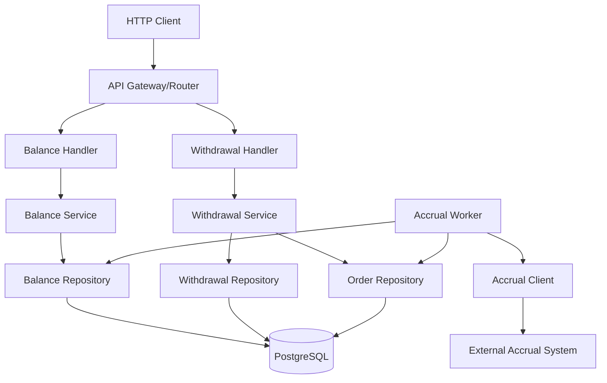
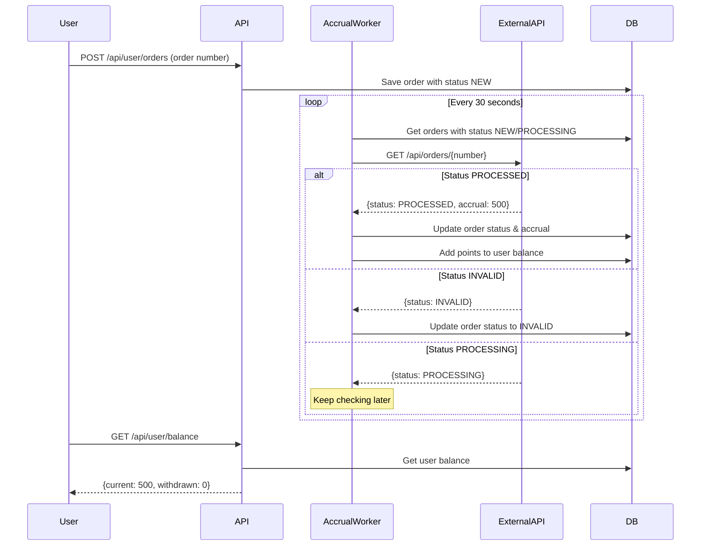

# Design Document

## Overview

Система начисления баллов лояльности расширяет существующую архитектуру Гофермарт, добавляя функциональность управления балансом пользователей и интеграцию с внешним сервисом расчета баллов. Система следует существующим паттернам проекта: Handler -> Service -> Repository с добавлением фонового процесса для синхронизации с внешним API.

## Architecture

### High-Level Architecture



### Integration Flow



## Components and Interfaces

### 1. Balance Management

#### Balance Handler
```go
type BalanceHandler struct {
    service *BalanceService
}

func (h *BalanceHandler) GetBalance(w http.ResponseWriter, r *http.Request)
```

#### Balance Service
```go
type BalanceService struct {
    balanceRepo BalanceRepository
}

func (s *BalanceService) GetUserBalance(userID int) (*Balance, error)
func (s *BalanceService) AddPoints(userID int, amount float64) error
func (s *BalanceService) DeductPoints(userID int, amount float64) error
```

#### Balance Repository
```go
type BalanceRepository interface {
    GetBalance(userID int) (*Balance, error)
    UpdateBalance(userID int, currentDelta, withdrawnDelta float64) error
    CreateBalance(userID int) error
}
```

### 2. Withdrawal Management

#### Withdrawal Handler
```go
type WithdrawalHandler struct {
    service *WithdrawalService
}

func (h *WithdrawalHandler) WithdrawPoints(w http.ResponseWriter, r *http.Request)
func (h *WithdrawalHandler) GetWithdrawals(w http.ResponseWriter, r *http.Request)
```

#### Withdrawal Service
```go
type WithdrawalService struct {
    withdrawalRepo WithdrawalRepository
    balanceService *BalanceService
}

func (s *WithdrawalService) WithdrawPoints(userID int, orderNumber string, amount float64) error
func (s *WithdrawalService) GetUserWithdrawals(userID int) ([]*Withdrawal, error)
```

#### Withdrawal Repository
```go
type WithdrawalRepository interface {
    CreateWithdrawal(withdrawal *Withdrawal) error
    GetWithdrawalsByUserID(userID int) ([]*Withdrawal, error)
}
```

### 3. Accrual Integration

#### Accrual Client
```go
type AccrualClient struct {
    baseURL    string
    httpClient *http.Client
}

func (c *AccrualClient) GetOrderAccrual(orderNumber string) (*AccrualResponse, error)
```

#### Accrual Worker
```go
type AccrualWorker struct {
    client         *AccrualClient
    orderRepo      order.Repository
    balanceService *BalanceService
    interval       time.Duration
}

func (w *AccrualWorker) Start(ctx context.Context)
func (w *AccrualWorker) processOrders() error
```

## Data Models

### Balance Model
```go
type Balance struct {
    ID        int     `json:"-" db:"id"`
    UserID    int     `json:"-" db:"user_id"`
    Current   float64 `json:"current" db:"current"`
    Withdrawn float64 `json:"withdrawn" db:"withdrawn"`
    UpdatedAt time.Time `json:"-" db:"updated_at"`
}
```

### Withdrawal Model
```go
type Withdrawal struct {
    ID          int       `json:"-" db:"id"`
    UserID      int       `json:"-" db:"user_id"`
    OrderNumber string    `json:"order" db:"order_number"`
    Amount      float64   `json:"sum" db:"amount"`
    ProcessedAt time.Time `json:"processed_at" db:"processed_at"`
}
```

### Accrual Response Model
```go
type AccrualResponse struct {
    Order   string   `json:"order"`
    Status  string   `json:"status"`
    Accrual *float64 `json:"accrual,omitempty"`
}
```

### Database Schema

```sql
-- User balances table
CREATE TABLE user_balances (
    id SERIAL PRIMARY KEY,
    user_id INTEGER NOT NULL REFERENCES users(id) ON DELETE CASCADE,
    current DECIMAL(10,2) NOT NULL DEFAULT 0.00,
    withdrawn DECIMAL(10,2) NOT NULL DEFAULT 0.00,
    updated_at TIMESTAMP WITH TIME ZONE DEFAULT NOW(),
    UNIQUE(user_id)
);

-- Withdrawals table
CREATE TABLE withdrawals (
    id SERIAL PRIMARY KEY,
    user_id INTEGER NOT NULL REFERENCES users(id) ON DELETE CASCADE,
    order_number VARCHAR(255) NOT NULL,
    amount DECIMAL(10,2) NOT NULL,
    processed_at TIMESTAMP WITH TIME ZONE DEFAULT NOW()
);

-- Indexes for performance
CREATE INDEX idx_withdrawals_user_id ON withdrawals(user_id);
CREATE INDEX idx_withdrawals_processed_at ON withdrawals(processed_at DESC);
```

## Error Handling

### HTTP Error Responses
- **401 Unauthorized**: Invalid or missing authentication token
- **402 Payment Required**: Insufficient balance for withdrawal
- **422 Unprocessable Entity**: Invalid order number format (Luhn algorithm)
- **500 Internal Server Error**: Database errors, external service failures

### External Service Error Handling
- **429 Too Many Requests**: Respect Retry-After header, implement exponential backoff
- **500/503 Service Unavailable**: Retry with exponential backoff, max 5 attempts
- **Timeout**: 30-second timeout for external requests

### Concurrency Handling
- Use database transactions for balance updates to prevent race conditions
- Implement optimistic locking for balance modifications
- Handle duplicate withdrawal attempts with unique constraints

## Testing Strategy

### Unit Tests
- **Balance Service**: Test balance calculations, edge cases (negative balances)
- **Withdrawal Service**: Test validation, insufficient funds scenarios
- **Accrual Client**: Mock external API responses, test error handling
- **Repositories**: Test database operations, constraint violations

### Integration Tests
- **API Endpoints**: Test complete request/response cycles
- **Database Transactions**: Test concurrent balance updates
- **External Service Integration**: Test with mock accrual service

### End-to-End Tests
- **Complete User Journey**: Register → Submit Order → Check Balance → Withdraw Points
- **Accrual Processing**: Submit order → Wait for processing → Verify balance update
- **Error Scenarios**: Test 402, 422, 429 responses

### Performance Considerations
- **Database Indexing**: Optimize queries for user balances and withdrawals
- **Connection Pooling**: Reuse HTTP connections for external API calls
- **Rate Limiting**: Implement client-side rate limiting for external API
- **Batch Processing**: Process multiple orders in single worker iteration

### Monitoring and Observability
- **Metrics**: Track balance operations, withdrawal success rates, external API response times
- **Logging**: Log all balance changes, external API calls, error conditions
- **Health Checks**: Monitor external service availability, database connectivity